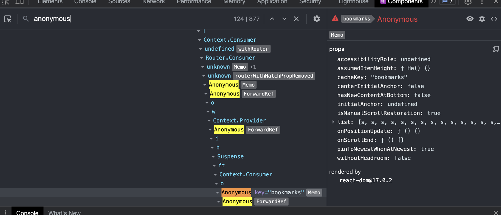
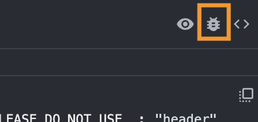
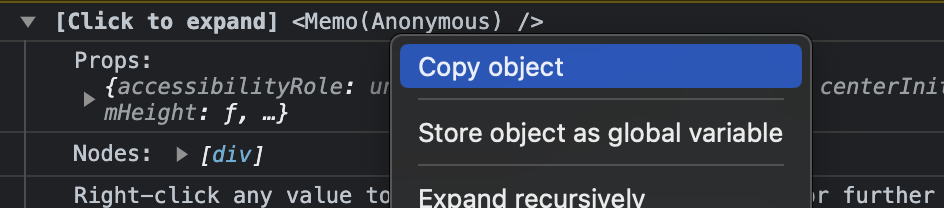

# twi-archiver
## What's this?
- Get your bookmark tweets from twitter
- Save them on my server
- Show it on app

## Dependencies
- Chrome
- React dev tool
- chromedriver(in server)

## features
|status|method|endpoint|feature|remarks|
|--|--|--|--|--|
|<ul><li>[x] </ul>|`POST`|`/twi-archiver`|upload tweet datas|see [usage](#usage) |
|<ul><li>[x] </ul>|`GET`|`/twi-archiver`|get tweet datas limit 10|for test|
|<ul><li>[x] </ul>|`GET`|`/twi-archiver/all`|get tweet datas all|**Warning**<br>`deplicateed` too many datas|
|<ul><li>[x] </ul>|`GET`|`/twi-archiver/show`|show html<br>(on your hosting server)|<ul>parameter<li>`lim`:set datas length, max:30, default:10<li>`divid`:define id on div element</ul>after laoad html, call `GET` `/twi-archiver/render`<br>pass through parameters|
|<ul><li>[x] </ul>|`GET`|`/twi-archiver/render`|render data with twitter-embed|<ul>parameter<li>`lim`:set datas length, max:30, default:10<li>`divid`:define id on div element</ul>|
|<ul><li>[ ] </ul>|wip|wip|set category by scraping|maybe goes on batch|

## Usage
### 1. Open your twitter (and login), go to bookmarks page

https://twitter.com/i/bookmarks

### 2. Scroll all, to fetch all bookmarks

on chrome dev-tool console
```js
// scroll bottom
tid = setInterval(() => scroll(0,1e8), 300)
```
```js
// after scroll all, stop
clearInterval(tid)
```

### 3. Open React-dev-tool, find component

search `anonymous(124)` with `key=bookmarks` and `Memo` component




then click here



### 4. Get and Upload

right click Props's "object", choose `Copy object`



twitter.com has CSP(Content Security Policy). detail -> [see also this](https://developer.mozilla.org/en-US/docs/Web/HTTP/CSP)

and you cannot call fetchAPI on this page console.

so, you have to move any other page such as

https://yourdomain

and execute this script on console

```js
// copied data for variable "temp1"
temp1 = 
```

then upload script is here
```js
fetch(`https://yourdomain-apibase-path/twi-archiver`, {
    method: "POST",
    headers: {"Content-Type": "application/json", "some-custome-header": "some token"},
    body: JSON.stringify(temp1?.list?.filter(v => v.id.startsWith("tweet")).map(v => v.id.match(/tweet-(.*)/)[1])||[])
}).then(r => r.json()).then(console.log)
```

### 5. finally
show in https://yourdomain-apibase-path/twi-archiver/show


